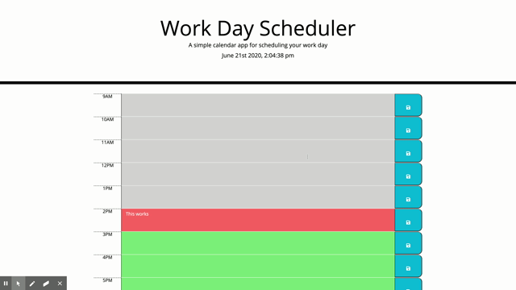

# 05-WorkDay-Scheduler

## Purpose:

A simple calendar application that allows the user to save events for each hour of the day.

### Logic and usage:

The logic behind this app is simple enough to articulate.

The first part is to utilise moment.js in order to display the current date and time on the page.

The second part is to determine the current time of the scheduler and change its colour accordingly. In other words, each time block is color coded to indicate whether it is in the past (gray), present (red) or future (green).

The final part is to save your plans to the local storage so that you can still access to them even you refresh the page.

#### Challenges

This app is not responsive, which means it cannot be rendering appropriately on mobile phones and small displays. This is due to the use of style.css, which can result in many conflicts if using it with bootstrap libray altogether.

##### Demo

The following animation demonstrates the application functionality:

Please also visit the deployed page (https://vulgarity2elegance.github.io/05-WorkDay-Scheduler/) and try it yourself!
